# 🛡️ SQL-Guardian: Enterprise-Grade Natural Language to SQL Agent

[](https://www.python.org/downloads/)
[](https://fastapi.tiangolo.com/)
[](https://langchain-ai.github.io/langgraph/)
[](https://www.docker.com/)
[](https://opensource.org/licenses/MIT)

## 🎯 Overview

**SQL-Guardian** is an intelligent agentic system that safely translates natural language queries into SQL operations across multiple databases with **enterprise-grade human-in-the-loop safety controls**. The system automatically executes safe **read operations** (SELECT queries) while gating all **database mutations** (INSERT, UPDATE, DELETE, DROP, ALTER) behind mandatory human approval checkpoints.

### ✨ Key Features

| Feature                           | Description                                                     |
| --------------------------------- | --------------------------------------------------------------- |
| 🤖 **AI-Powered Translation**     | Uses Google Gemini 2.0 Flash to convert natural language to SQL |
| 🔒 **Safety-First Architecture**  | Automatic execution for reads, mandatory approval for writes    |
| 🔄 **ReAct Agent Pattern**        | Implements iterative reasoning and action loops                 |
| 📊 **Multi-Database Support**     | Simultaneous access to HR and Sales databases                   |
| ⚡ **FastAPI REST Interface**     | Production-ready API with OpenAPI documentation                 |
| 🎭 **Human-in-the-Loop Patterns** | Supports approve, reject, and edit workflows                    |
| 🐳 **Docker-Ready**               | Fully containerized with Docker Compose support                 |
| 📈 **State Persistence**          | LangGraph checkpointing for resumable workflows                 |

### 🎬 Quick Demo

```bash
# Safe query - executes immediately
curl -X POST "http://localhost:8000/query" \
  -H "Content-Type: application/json" \
  -d '{"text": "Show me all employees in Engineering"}'

# Dangerous query - requires approval
curl -X POST "http://localhost:8000/query" \
  -H "Content-Type: application/json" \
  -d '{"text": "Delete all employees from Marketing"}'
# Returns: {"status": "approval_required", "thread_id": "...", ...}

# Approve the mutation
curl -X POST "http://localhost:8000/mutations/approve" \
  -H "Content-Type: application/json" \
  -d '{"thread_id": "...", "decision": "approve"}'
```

## 🏗️ Architecture

### Technology Stack

| Component            | Technology                   | Purpose                                               |
| -------------------- | ---------------------------- | ----------------------------------------------------- |
| **AI Engine**        | Google Gemini 2.0 Flash Lite | Natural language understanding & SQL generation       |
| **Agent Framework**  | LangGraph + LangChain        | State machine orchestration & ReAct pattern           |
| **API Server**       | FastAPI + Uvicorn            | REST endpoints with automatic OpenAPI docs            |
| **Database**         | SQLite 3                     | Dual databases (HR & Sales) with full ACID compliance |
| **State Management** | LangGraph MemorySaver        | Persistent checkpointing for interrupt/resume         |
| **Containerization** | Docker + Docker Compose      | Production deployment with health checks              |
| **Environment**      | Python 3.11                  | Modern Python with type hints                         |

### System Architecture

```mermaid
graph TB
    subgraph Client["🌐 Client Layer"]
        USER[👤 User/Application]
    end

    subgraph API["⚡ API Layer - FastAPI"]
        HEALTH[GET /health]
        QUERY[POST /query]
        APPROVE[POST /mutations/approve]
        STATUS[GET /threads/:id/state]
    end

    subgraph Agent["🤖 Agent Layer - LangGraph"]
        REACT[ReAct Agent<br/>Reasoning Loop]
        ROUTER{Safety Router}
        EXECUTOR[Tool Executor]
    end

    subgraph Safety["🛡️ Safety Layer"]
        CLASSIFIER[SQL Classifier<br/>READ vs WRITE]
        INTERRUPT[Human Approval<br/>Interrupt Node]
    end

    subgraph Tools["🔧 Tool Layer"]
        HR_TOOLS[HR Toolkit<br/>4 specialized tools]
        SALES_TOOLS[Sales Toolkit<br/>4 specialized tools]
    end

    subgraph Data["💾 Data Layer"]
        HR_DB[(HR Database<br/>departments, employees, salaries)]
        SALES_DB[(Sales Database<br/>customers, products, orders, order_items)]
    end

    USER -->|Natural Language Query| QUERY
    QUERY --> REACT
    REACT --> CLASSIFIER
    CLASSIFIER -->|SELECT| EXECUTOR
    CLASSIFIER -->|INSERT/UPDATE/DELETE| INTERRUPT

    INTERRUPT -->|Approved| EXECUTOR
    INTERRUPT -->|Rejected| QUERY
    INTERRUPT -->|Edited| EXECUTOR

    EXECUTOR --> HR_TOOLS
    EXECUTOR --> SALES_TOOLS

    HR_TOOLS --> HR_DB
    SALES_TOOLS --> SALES_DB

    HR_DB --> REACT
    SALES_DB --> REACT

    REACT -->|Final Result| QUERY
    QUERY -->|JSON Response| USER

    USER -->|Approval Decision| APPROVE
    APPROVE --> INTERRUPT

    USER -->|Poll Status| STATUS

    style INTERRUPT fill:#ff6b6b
    style CLASSIFIER fill:#ffd93d
    style REACT fill:#6bcf7f
    style USER fill:#4dabf7
```



### Agent Workflow: ReAct Pattern

```mermaid
stateDiagram-v2
    [*] --> AgentNode: User Query

    AgentNode --> RouteDecision: Generate Action

    RouteDecision --> ToolsNode: AgentAction (Safe SQL)
    RouteDecision --> HumanApprovalNode: AgentAction (Dangerous SQL)
    RouteDecision --> [*]: AgentFinish

    HumanApprovalNode --> ApprovalDecision: Interrupt & Wait

    ApprovalDecision --> ToolsNode: Approve ✅
    ApprovalDecision --> [*]: Reject ❌
    ApprovalDecision --> ToolsNode: Edit & Execute 📝

    ToolsNode --> AgentNode: Execute Tool<br/>Add to State

    note right of HumanApprovalNode
        Detects: INSERT, UPDATE, DELETE
        DROP, ALTER, CREATE, TRUNCATE
        GRANT, REVOKE, MERGE, etc.
    end note

    note right of ToolsNode
        8 SQL Tools Total:
        - hr_sql_db_query
        - hr_sql_db_schema
        - hr_sql_db_list_tables
        - hr_sql_db_query_checker
        - sales_sql_db_query
        - sales_sql_db_schema
        - sales_sql_db_list_tables
        - sales_sql_db_query_checker
    end note
```



### Safety Decision Flow

```mermaid
flowchart TD
    START([Natural Language Query]) --> PARSE[Parse Intent<br/>via Gemini LLM]
    PARSE --> IDENTIFY[Identify Target Database<br/>HR vs Sales]
    IDENTIFY --> GENERATE[Generate SQL Statement]
    GENERATE --> CLASSIFY{Classify Query Type}

    CLASSIFY -->|SELECT| AUTO[✅ Auto-Execute]
    CLASSIFY -->|INSERT| PAUSE[⏸️ Request Approval]
    CLASSIFY -->|UPDATE| PAUSE
    CLASSIFY -->|DELETE| PAUSE
    CLASSIFY -->|DROP| PAUSE
    CLASSIFY -->|ALTER| PAUSE
    CLASSIFY -->|CREATE| PAUSE
    CLASSIFY -->|TRUNCATE| PAUSE

    AUTO --> EXECUTE[Execute Query]
    EXECUTE --> RETURN_SUCCESS([Return Results])

    PAUSE --> INTERRUPT[LangGraph Interrupt]
    INTERRUPT --> WAIT{Human Decision}

    WAIT -->|Approve| EXECUTE
    WAIT -->|Reject| RETURN_REJECT([Return Rejection])
    WAIT -->|Edit SQL| MODIFY[Update Query]
    MODIFY --> EXECUTE

    style START fill:#e3f2fd
    style CLASSIFY fill:#fff3e0
    style AUTO fill:#c8e6c9
    style PAUSE fill:#ffccbc
    style WAIT fill:#f8bbd0
    style RETURN_SUCCESS fill:#c8e6c9
    style RETURN_REJECT fill:#ffcdd2
```



## 🚀 Quick Start

### Prerequisites

| Requirement    | Version | Purpose                     |
| -------------- | ------- | --------------------------- |
| Python         | 3.11+   | Core runtime                |
| Docker         | 20.10+  | (Optional) Containerization |
| Google API Key | -       | Gemini LLM access           |

### Option 1: Docker Compose (Recommended) ⭐

The fastest way to get SQL-Guardian running:

```bash
# 1. Clone the repository
git clone <repository-url>
cd SQl-Guardian

# 2. Create .env file with your Google API key
cat > .env << EOF
GOOGLE_API_KEY=your-google-api-key-here
EOF

# 3. Start with Docker Compose
docker-compose up --build -d

# 4. Verify it's running
curl http://localhost:8000/health
```

**Access Points:**

- 📚 API Docs: http://localhost:8000/docs
- 🏥 Health Check: http://localhost:8000/health
- 🔄 Alternative Docs: http://localhost:8000/redoc

### Option 2: Docker Manual Build

```bash
# Build the image
docker build -t sql-guardian .

# Run the container
docker run -p 8000:8000 \
  -e GOOGLE_API_KEY='your-api-key' \
  --name sql-guardian \
  sql-guardian

# View logs
docker logs -f sql-guardian

# Stop the container
docker stop sql-guardian
```

### Option 3: Local Development (Python Virtual Environment)

```bash
# 1. Create and activate virtual environment
python3 -m venv venv
source venv/bin/activate  # On Windows: venv\Scripts\activate

# 2. Install dependencies
pip install -r requirements.txt

# 3. Create .env file
echo "GOOGLE_API_KEY=your-google-api-key-here" > .env

# 4. Setup databases (auto-creates data/hr.db and data/sales.db)
python setup_databases.py

# 5. Start the server
uvicorn app.main:app --reload --host 0.0.0.0 --port 8000
```

**Development Features:**

- 🔥 Hot reload on code changes
- 📊 Detailed error traces
- 🔍 Debug mode enabled

### Option 4: Local Development (Conda)

```bash
# 1. Create Conda environment
conda create -n sql-guardian python=3.11 -y
conda activate sql-guardian

# 2. Install dependencies
pip install -r requirements.txt

# 3. Setup environment and databases
echo "GOOGLE_API_KEY=your-api-key" > .env
python setup_databases.py

# 4. Start server
uvicorn app.main:app --reload
```


## 📡 API Reference

### Endpoint Overview

| Method | Endpoint                     | Auth | Purpose                       | Status Codes       |
| ------ | ---------------------------- | ---- | ----------------------------- | ------------------ |
| `GET`  | `/`                          | -    | Root endpoint with API info   | 200                |
| `GET`  | `/health`                    | -    | Health check                  | 200                |
| `POST` | `/query`                     | -    | Submit natural language query | 200, 500           |
| `POST` | `/mutations/approve`         | -    | Approve/reject/edit mutations | 200, 400, 404, 500 |
| `GET`  | `/threads/{thread_id}/state` | -    | Get thread state              | 200                |
| `GET`  | `/docs`                      | -    | Interactive API documentation | 200                |
| `GET`  | `/redoc`                     | -    | Alternative API docs          | 200                |

### 1. POST /query - Initiate Query

Submit a natural language query to be translated into SQL.

**Request Body:**

```json
{
  "text": "Show me all employees in the Engineering department"
}
```

**Response (Auto-Executed - SELECT):**

```json
{
  "thread_id": "550e8400-e29b-41d4-a716-446655440000",
  "status": "completed",
  "result": "Found 3 employees in Engineering: Alice Johnson (alice.johnson@company.com), Bob Smith (bob.smith@company.com), Grace Lee (grace.lee@company.com)",
  "summary": "Query completed.",
  "agent_outcome": null,
  "messages": [...]
}
```

**Response (Requires Approval - INSERT/UPDATE/DELETE):**

```json
{
  "thread_id": "550e8400-e29b-41d4-a716-446655440000",
  "status": "approval_required",
  "interrupt_data": [
    {
      "action_required": "review_and_approve",
      "operation_type": "INSERT",
      "tool_name": "hr_sql_db_query",
      "sql_query": "INSERT INTO employees (name, email, dept_id, hire_date) VALUES ('John Doe', 'john.doe@company.com', 1, '2025-10-01')",
      "warning": "This operation will modify the database. Please review carefully.",
      "options": {
        "approve": "Execute the query as shown",
        "reject": "Cancel this operation",
        "edit": "Modify the query before execution"
      }
    }
  ],
  "agent_outcome": {
    "type": "action",
    "tool": "hr_sql_db_query",
    "tool_input": "INSERT INTO employees...",
    "log": "Proposing to insert new employee"
  },
  "message": "Approval is required for this database mutation."
}
```

### 2. POST /mutations/approve - Approve/Reject/Edit

Handle human-in-the-loop decision for write operations.

**Request Body (Approve):**

```json
{
  "thread_id": "550e8400-e29b-41d4-a716-446655440000",
  "decision": "approve"
}
```

**Request Body (Reject):**

```json
{
  "thread_id": "550e8400-e29b-41d4-a716-446655440000",
  "decision": "reject"
}
```

**Request Body (Edit):**

```json
{
  "thread_id": "550e8400-e29b-41d4-a716-446655440000",
  "decision": "edit",
  "modified_sql": "INSERT INTO employees (name, email, dept_id, hire_date) VALUES ('Jane Doe', 'jane.doe@company.com', 1, CURRENT_DATE)"
}
```

**Response (Approved):**

```json
{
  "thread_id": "550e8400-e29b-41d4-a716-446655440000",
  "status": "approved_and_executed",
  "result": "Employee successfully inserted into HR database.",
  "summary": "Operation completed."
}
```

**Response (Rejected):**

```json
{
  "thread_id": "550e8400-e29b-41d4-a716-446655440000",
  "status": "rejected",
  "message": "Database mutation was rejected. Workflow terminated."
}
```

**Response (Edited):**

```json
{
  "thread_id": "550e8400-e29b-41d4-a716-446655440000",
  "status": "edited_and_executed",
  "result": "Employee successfully inserted with modified SQL.",
  "summary": "Operation completed with human-edited SQL.",
  "modified_sql": "INSERT INTO employees..."
}
```

### 3. GET /threads/{thread_id}/state - Check Status

Poll the current state of a query thread.

**Response:**

```json
{
  "thread_id": "550e8400-e29b-41d4-a716-446655440000",
  "status": "pending",
  "state": {
    "messages": [...],
    "agent_outcome": {...},
    "last_tool_result": null,
    "next": ["human_approval"],
    "metadata": {...}
  },
  "pending_action": {
    "type": "action",
    "tool": "hr_sql_db_query",
    "tool_input": "INSERT INTO..."
  }
}
```

### End-to-End Workflow Examples

#### 1. Safe SELECT Query (Automatic Execution)

```bash
# Query employee information (automatically executed)
curl -X POST "http://localhost:8000/query" \
  -H "Content-Type: application/json" \
  -d '{"text": "Show me all employees in the Engineering department"}'

# Expected Response:
# {
#   "thread_id": "uuid-here",
#   "status": "completed",
#   "result": "Employee data from HR database..."
# }
```

#### 2. Write Query (Human-in-the-Loop Workflow)

**Step 1: Initiate a write operation**

```bash
# Attempt to insert a new employee (requires approval)
curl -X POST "http://localhost:8000/query" \
  -H "Content-Type: application/json" \
  -d '{"text": "Insert a new employee named John Doe in the Engineering department"}'

# Expected Response:
# {
#   "thread_id": "abc123-def456-ghi789",
#   "status": "approval_required",
#   "agent_outcome": {
#     "tool": "sql_db_query",
#     "tool_input": "INSERT INTO employees (name, email, dept_id) VALUES...",
#     "log": "Proposed SQL mutation"
#   },
#   "message": "Approval is now required for this database mutation."
# }
```

**Step 2: Check the pending status**

```bash
# Check what's pending approval
curl -X GET "http://localhost:8000/threads/abc123-def456-ghi789/state"

# Expected Response:
# {
#   "thread_id": "abc123-def456-ghi789",
#   "status": "pending",
#   "pending_action": {...},
#   "state": {...}
# }
```

**Step 3: Approve the mutation**

```bash
# Approve the database mutation
curl -X POST "http://localhost:8000/mutations/approve" \
  -H "Content-Type: application/json" \
  -d '{
    "thread_id": "abc123-def456-ghi789",
    "decision": "approve"
  }'

# Expected Response:
# {
#   "thread_id": "abc123-def456-ghi789",
#   "status": "approved_and_executed",
#   "result": "Employee successfully inserted into HR database."
# }
```

**Step 3 (Alternative): Reject the mutation**

```bash
# Reject the database mutation
curl -X POST "http://localhost:8000/mutations/approve" \
  -H "Content-Type: application/json" \
  -d '{
    "thread_id": "abc123-def456-ghi789",
    "decision": "reject"
  }'

# Expected Response:
# {
#   "thread_id": "abc123-def456-ghi789",
#   "status": "rejected",
#   "message": "Database mutation was rejected. Workflow terminated."
# }
```

## Database Schema

### HR Database (`data/hr.db`)

```sql
-- Departments table
CREATE TABLE departments (
    id INTEGER PRIMARY KEY AUTOINCREMENT,
    name VARCHAR(100) NOT NULL UNIQUE
);

-- Employees table
CREATE TABLE employees (
    id INTEGER PRIMARY KEY AUTOINCREMENT,
    name VARCHAR(100) NOT NULL,
    email VARCHAR(100) NOT NULL UNIQUE,
    hire_date DATE NOT NULL,
    dept_id INTEGER NOT NULL,
    FOREIGN KEY (dept_id) REFERENCES departments (id)
);

-- Salaries table
CREATE TABLE salaries (
    id INTEGER PRIMARY KEY AUTOINCREMENT,
    amount DECIMAL(10, 2) NOT NULL,
    effective_date DATE NOT NULL,
    emp_id INTEGER NOT NULL,
    FOREIGN KEY (emp_id) REFERENCES employees (id)
);
```

### Sales Database (`data/sales.db`)

```sql
-- Customers table
CREATE TABLE customers (
    id INTEGER PRIMARY KEY AUTOINCREMENT,
    name VARCHAR(100) NOT NULL,
    email VARCHAR(100) NOT NULL UNIQUE
);

-- Products table
CREATE TABLE products (
    id INTEGER PRIMARY KEY AUTOINCREMENT,
    name VARCHAR(100) NOT NULL,
    price DECIMAL(10, 2) NOT NULL
);

-- Orders table
CREATE TABLE orders (
    id INTEGER PRIMARY KEY AUTOINCREMENT,
    created_at DATETIME NOT NULL,
    customer_id INTEGER NOT NULL,
    FOREIGN KEY (customer_id) REFERENCES customers (id)
);

-- Order items table
CREATE TABLE order_items (
    id INTEGER PRIMARY KEY AUTOINCREMENT,
    quantity INTEGER NOT NULL,
    unit_price DECIMAL(10, 2) NOT NULL,
    order_id INTEGER NOT NULL,
    product_id INTEGER NOT NULL,
    FOREIGN KEY (order_id) REFERENCES orders (id),
    FOREIGN KEY (product_id) REFERENCES products (id)
);
```

## Safety Features

### Automatic Query Classification

- **✅ Safe Operations**: SELECT queries execute automatically
- **⚠️ Dangerous Operations**: INSERT, UPDATE, DELETE require human approval
- **🔍 Pattern Recognition**: Case-insensitive SQL keyword detection
- **🛡️ Default Safe**: Unknown patterns default to safe execution

### Human-in-the-Loop Controls

- **⏸️ Persistent Interrupts**: Graph state preserved during approval
- **🔄 Resumable Workflows**: Continue from exact interruption point
- **📊 State Inspection**: Full visibility into pending operations
- **❌ Safe Termination**: Clean rejection without side effects

### Enterprise Security

- **🔐 Thread Isolation**: UUID-based session management
- **📝 Audit Trail**: Complete operation logging
- **🚫 Fail-Safe Design**: Errors default to safe states
- **🔍 Transparent Operations**: Full SQL query visibility before execution

## Sample Queries to Test

### Safe Queries (Auto-Execute)

```
"Show me all employees in the Engineering department"
"What are the top 5 highest paid employees?"
"List all customers who made orders in the last 30 days"
"Show me the total revenue by product category"
```

### Dangerous Queries (Require Approval)

```
"Delete all employees from the Engineering department"
"Update all product prices to increase by 10%"
"Insert a new employee named Alice Smith"
"Remove all orders older than 6 months"
```

## Usage

### Basic Query Workflow

SQL-Guardian supports natural language queries that are automatically converted to SQL and executed against your databases. The system distinguishes between safe read operations and potentially dangerous write operations.

#### Read Operations (Automatic Execution)

Read operations using SELECT queries execute immediately without requiring approval:

```bash
# Example read queries
curl -X POST "http://localhost:8000/query" \
  -H "Content-Type: application/json" \
  -d '{"text": "Show me all employees"}'

curl -X POST "http://localhost:8000/query" \
  -H "Content-Type: application/json" \
  -d '{"text": "What are the total sales by customer?"}'
```

#### Write Operations (Human-in-the-Loop)

Write operations (INSERT, UPDATE, DELETE) require human approval:

```bash
# Step 1: Submit write query
curl -X POST "http://localhost:8000/query" \
  -H "Content-Type: application/json" \
  -d '{"text": "Insert a new employee named John Smith"}'

# Response includes thread_id for approval process
# {"thread_id": "abc-123", "status": "approval_required", ...}

# Step 2: Approve or reject the operation
curl -X POST "http://localhost:8000/mutations/approve" \
  -H "Content-Type: application/json" \
  -d '{"thread_id": "abc-123", "decision": "approve"}'
```

### Supported Natural Language Patterns

SQL-Guardian understands various natural language patterns for database operations:

#### Query Patterns

- "Show me all [table]"
- "List [columns] from [table]"
- "Find [conditions]"
- "What are the [aggregations]?"
- "Get [data] where [conditions]"

#### Insert Patterns

- "Add a new [record] with [values]"
- "Insert [data] into [table]"
- "Create a [record] named [name]"

#### Update Patterns

- "Update [table] set [column] to [value]"
- "Change [field] for [conditions]"
- "Modify [record] where [conditions]"

#### Delete Patterns

- "Delete [records] where [conditions]"
- "Remove [data] from [table]"
- "Drop [table/records]"

### Safety Features in Practice

#### Automatic Classification

- **SELECT queries**: Execute immediately
- **INSERT/UPDATE/DELETE**: Pause for approval
- **DDL operations**: Require approval (CREATE, DROP, ALTER)
- **Administrative commands**: Require approval (GRANT, REVOKE)

#### Approval Workflow

1. Submit query via `/query` endpoint
2. System analyzes SQL intent
3. If dangerous: Returns `approval_required` status with thread_id
4. Human reviews proposed SQL via `/threads/{thread_id}/state`
5. Human approves/rejects via `/mutations/approve`
6. If approved: Operation executes and returns results

### Monitoring and Logging

Check query status and review pending operations:

```bash
# Check thread status
curl "http://localhost:8000/threads/{thread_id}/state"

# Health check
curl "http://localhost:8000/health"
```

## Examples and Use Cases

### Example 1: Employee Information Query (Read - Auto-Execute)

**Query**: "Show me all employees in the Engineering department"

**Expected Workflow**:

1. User submits natural language query
2. Agent analyzes and identifies as SELECT operation
3. Query executes automatically
4. Results returned immediately

**Sample Response**:

```json
{
  "thread_id": "abc-123-def",
  "status": "completed",
  "result": "Found 3 employees in Engineering: Alice Johnson, Bob Smith, Grace Lee"
}
```

### Example 2: Adding New Employee (Write - Requires Approval)

**Query**: "Insert a new employee named John Doe in the Engineering department with email john.doe@company.com"

**Expected Workflow**:

1. User submits natural language query
2. Agent analyzes and identifies as INSERT operation
3. System pauses and requests human approval
4. Human reviews and approves/rejects
5. If approved, operation executes

**Sample Approval Request**:

```json
{
  "thread_id": "xyz-789-abc",
  "status": "approval_required",
  "agent_outcome": {
    "tool": "hr_sql_db_query",
    "tool_input": "INSERT INTO employees (name, email, dept_id, hire_date) VALUES ('John Doe', 'john.doe@company.com', 1, '2025-09-30')",
    "log": "Proposing to insert new employee into HR database"
  },
  "message": "Approval is required for this database mutation."
}
```

### Example 3: Sales Data Analysis (Read - Auto-Execute)

**Query**: "What are the top 3 best-selling products by total revenue?"

**Expected Workflow**:

1. Agent identifies complex analytical query as safe SELECT
2. Generates appropriate JOIN query across sales tables
3. Executes automatically and returns results

**Sample Response**:

```json
{
  "thread_id": "def-456-ghi",
  "status": "completed",
  "result": "Top products by revenue: 1. Data Analytics Platform ($74,999.85), 2. Machine Learning Platform ($23,999.94), 3. Enterprise Software License ($20,999.93)"
}
```

### Example 4: Dangerous Operation (Write - Requires Approval)

**Query**: "Delete all orders older than 1 year"

**Expected Workflow**:

1. Agent identifies as potentially destructive DELETE operation
2. System immediately pauses for approval
3. Shows exact SQL that would be executed
4. Waits for human decision

**Sample Approval Request**:

```json
{
  "thread_id": "ghi-012-jkl",
  "status": "approval_required",
  "agent_outcome": {
    "tool": "sales_sql_db_query",
    "tool_input": "DELETE FROM orders WHERE created_at < date('now', '-1 year')",
    "log": "Proposing to delete historical orders from sales database"
  },
  "message": "⚠️ CAUTION: This operation will permanently delete data. Review carefully before approving."
}
```

## Troubleshooting

### Common Issues

1. **API Key Error**

   ```
   Error: Google API key not found
   Solution: Ensure GOOGLE_API_KEY is set in .env file
   ```

2. **Database Not Found**

   ```
   Error: No such table: employees
   Solution: Run python setup_databases.py
   ```

3. **Port Already in Use**

   ```
   Error: Port 8000 is already in use
   Solution: Use --port 8001 or kill existing process
   ```

4. **Import Errors**
   ```
   Error: No module named 'langchain_google_genai'
   Solution: pip install -r requirements.txt
   ```

## Development

### Project Structure

```
sql-guardian/
├── app/
│   ├── __init__.py          # Package initialization
│   ├── main.py              # FastAPI application
│   ├── agent.py             # LangGraph agent logic
│   └── toolkits.py          # Database toolkits
├── data/
│   ├── hr.db                # HR database (auto-generated)
│   └── sales.db             # Sales database (auto-generated)
├── setup_databases.py       # Database initialization script
├── requirements.txt         # Python dependencies
├── Dockerfile              # Container configuration
├── .env                    # Environment variables
├── .gitignore              # Git exclusions
└── README.md               # This file
```

### Technology Stack

- **Backend**: Python 3.11, FastAPI, Uvicorn
- **AI/ML**: LangChain, LangGraph, Google Gemini
- **Database**: SQLite, SQLAlchemy
- **Deployment**: Docker, Environment-based configuration
- **Development**: Conda, pip, Git

_Built for data safety and developer productivity._
