# 🛡️ SQL-Guardian: Natural Language to SQL Agent

[](https://www.python.org/downloads/)
[](https://fastapi.tiangolo.com/)
[](https://langchain-ai.github.io/langgraph/)
[](https://www.docker.com/)
[](https://opensource.org/licenses/MIT)

## 🎯 Overview

**SQL-Guardian** is an agentic system that translates natural language queries into SQL operations across multiple databases with human-in-the-loop safety controls. The system automatically executes read operations (SELECT queries) and gates all database mutations (INSERT, UPDATE, DELETE) behind a human approval checkpoint.

### ✨ Key Features

| Feature | Description |
| --- | --- |
| **AI-Powered Translation** | Uses Google Gemini to convert natural language to SQL. |
| **Safety-First Architecture** | Automatic execution for reads, mandatory approval for writes. |
| **ReAct Agent Pattern** | Implements iterative reasoning and action loops. |
| **Multi-Database Support** | Accesses HR and Sales databases. |
| **FastAPI REST Interface** | Provides a REST API with OpenAPI documentation. |
| **Human-in-the-Loop** | Supports approve, reject, and edit workflows. |
| **Containerized** | Includes Docker Compose support. |
| **State Persistence** | Uses LangGraph checkpointing for resumable workflows. |

## 🏗️ Architecture

### Technology Stack

| Component | Technology | Purpose |
| --- | --- | --- |
| **AI Engine** | Google Gemini | Natural language understanding & SQL generation. |
| **Agent Framework** | LangGraph + LangChain | State machine orchestration & ReAct pattern. |
| **API Server** | FastAPI + Uvicorn | REST endpoints with OpenAPI documentation. |
| **Database** | SQLite 3 | Dual databases (HR & Sales). |
| **State Management** | LangGraph MemorySaver | Persistent checkpointing for workflows. |
| **Containerization** | Docker + Docker Compose | Deployment with health checks. |
| **Environment** | Python 3.11 | Core runtime. |

### System Architecture

```mermaid
graph TB
    subgraph Client["🌐 Client Layer"]
        USER[👤 User/Application]
    end

    subgraph API["⚡ API Layer - FastAPI"]
        HEALTH[GET /health]
        QUERY[POST /query]
        APPROVE[POST /mutations/approve]
        STATUS[GET /threads/:id/state]
    end

    subgraph Agent["🤖 Agent Layer - LangGraph"]
        REACT[ReAct Agent<br/>Reasoning Loop]
        ROUTER{Safety Router}
        EXECUTOR[Tool Executor]
    end

    subgraph Safety["🛡️ Safety Layer"]
        CLASSIFIER[SQL Classifier<br/>READ vs WRITE]
        INTERRUPT[Human Approval<br/>Interrupt Node]
    end

    subgraph Tools["🔧 Tool Layer"]
        HR_TOOLS[HR Toolkit<br/>4 specialized tools]
        SALES_TOOLS[Sales Toolkit<br/>4 specialized tools]
    end

    subgraph Data["💾 Data Layer"]
        HR_DB[(HR Database<br/>departments, employees, salaries)]
        SALES_DB[(Sales Database<br/>customers, products, orders, order_items)]
    end

    USER -->|Natural Language Query| QUERY
    QUERY --> REACT
    REACT --> CLASSIFIER
    CLASSIFIER -->|SELECT| EXECUTOR
    CLASSIFIER -->|INSERT/UPDATE/DELETE| INTERRUPT

    INTERRUPT -->|Approved| EXECUTOR
    INTERRUPT -->|Rejected| QUERY
    INTERRUPT -->|Edited| EXECUTOR

    EXECUTOR --> HR_TOOLS
    EXECUTOR --> SALES_TOOLS

    HR_TOOLS --> HR_DB
    SALES_TOOLS --> SALES_DB

    HR_DB --> REACT
    SALES_DB --> REACT

    REACT -->|Final Result| QUERY
    QUERY -->|JSON Response| USER

    USER -->|Approval Decision| APPROVE
    APPROVE --> INTERRUPT

    USER -->|Poll Status| STATUS

```



### Agent Workflow: ReAct Pattern

```mermaid
stateDiagram-v2
    [*] --> AgentNode: User Query

    AgentNode --> RouteDecision: Generate Action

    RouteDecision --> ToolsNode: AgentAction (Safe SQL)
    RouteDecision --> HumanApprovalNode: AgentAction (Dangerous SQL)
    RouteDecision --> [*]: AgentFinish

    HumanApprovalNode --> ApprovalDecision: Interrupt & Wait

    ApprovalDecision --> ToolsNode: Approve ✅
    ApprovalDecision --> [*]: Reject ❌
    ApprovalDecision --> ToolsNode: Edit & Execute 📝

    ToolsNode --> AgentNode: Execute Tool<br/>Add to State

    note right of HumanApprovalNode
        Detects: INSERT, UPDATE, DELETE
        DROP, ALTER, CREATE, TRUNCATE
        GRANT, REVOKE, MERGE, etc.
    end note

    note right of ToolsNode
        8 SQL Tools Total:
        - hr_sql_db_query
        - hr_sql_db_schema
        - hr_sql_db_list_tables
        - hr_sql_db_query_checker
        - sales_sql_db_query
        - sales_sql_db_schema
        - sales_sql_db_list_tables
        - sales_sql_db_query_checker
    end note
```



### Safety Decision Flow


## Development

### Project Structure

```
sql-guardian/
├── app/
│   ├── main.py              # FastAPI application
│   ├── agent.py             # LangGraph agent logic
│   └── toolkits.py          # Database toolkits
├── data/
│   ├── hr.db
│   └── sales.db
├── setup_databases.py       # Database initialization script
├── requirements.txt         # Python dependencies
├── Dockerfile              # Container configuration
└── .env                    # Environment variables
```

## 🚀 Quick Start

### Prerequisites

| Requirement | Version | Purpose |
| --- | --- | --- |
| Python | 3.11+ | Core runtime |
| Docker | 20.10+ | (Optional) Containerization |
| Google API Key | - | Gemini LLM access |

### Option 1: Docker Compose (Recommended)

This is the fastest way to get SQL-Guardian running.

```bash
# 1. Clone the repository
git clone <repository-url>
cd sql-guardian

# 2. Create .env file with your Google API key
cat > .env << EOF
GOOGLE_API_KEY=your-google-api-key-here
EOF

# 3. Start with Docker Compose
docker-compose up --build -d

# 4. Verify it's running
curl http://localhost:8000/health
```

**Access Points:**

*   **API Docs:** `http://localhost:8000/docs`
*   **Health Check:** `http://localhost:8000/health`

### Option 2: Local Development (Conda)

```bash
# 1. Create and activate Conda environment
conda create -n sql-guardian python=3.11 -y
conda activate sql-guardian

# 2. Install dependencies
pip install -r requirements.txt

# 3. Create .env file with your Google API key
echo "GOOGLE_API_KEY=your-google-api-key-here" > .env

# 4. Setup databases
python setup_databases.py

# 5. Start the server
uvicorn app.main:app --reload --host 0.0.0.0 --port 8000
```

## 📡 API Reference

### Endpoint Overview

| Method | Endpoint | Purpose |
| --- | --- | --- |
| `GET` | `/health` | Health check. |
| `POST` | `/query` | Submit a natural language query. |
| `POST` | `/mutations/approve` | Approve, reject, or edit a mutation. |
| `GET` | `/threads/{thread_id}/state` | Get the state of a query thread. |

### POST /query - Initiate Query

Submits a natural language query for translation to SQL.

**Request Body:**

```json
{
  "text": "Show me all employees in the Engineering department"
}
```

**Response (Auto-Executed - SELECT):**

```json
{
  "thread_id": "some-uuid",
  "status": "completed",
  "result": "Found 3 employees in Engineering: Alice, Bob, Carol",
  "summary": "Query completed."
}
```

**Response (Requires Approval - INSERT/UPDATE/DELETE):**

```json
{
  "thread_id": "some-uuid",
  "status": "approval_required",
  "interrupt_data": [
    {
      "action_required": "review_and_approve",
      "operation_type": "INSERT",
      "sql_query": "INSERT INTO employees (name) VALUES ('John Doe')",
      "warning": "This operation will modify the database."
    }
  ],
  "message": "Approval is required for this database mutation."
}
```

### POST /mutations/approve - Approve/Reject/Edit

Handles the human decision for a pending write operation.

**Request Body (Approve):**

```json
{
  "thread_id": "some-uuid",
  "decision": "approve"
}
```

**Request Body (Edit):**

```json
{
  "thread_id": "some-uuid",
  "decision": "edit",
  "modified_sql": "INSERT INTO employees (name) VALUES ('Jane Doe')"
}
```

**Response (Approved):**

```json
{
  "thread_id": "some-uuid",
  "status": "approved_and_executed",
  "result": "Employee successfully inserted.",
  "summary": "Operation completed."
}
```

### GET /threads/{thread_id}/state - Check Status

Polls the current state of a query thread.

**Response:**

```json
{
  "thread_id": "some-uuid",
  "status": "pending",
  "state": { ... },
  "pending_action": { ... }
}
```

### End-to-End Workflow Examples

#### 1. Safe SELECT Query (Automatic Execution)

```bash
# Query employee information
curl -X POST "http://localhost:8000/query" \
  -H "Content-Type: application/json" \
  -d '{"text": "Show me all employees in Engineering"}'
```

#### 2. Write Query (Human-in-the-Loop Workflow)

**Step 1: Initiate a write operation**

```bash
# Attempt to insert a new employee
curl -X POST "http://localhost:8000/query" \
  -H "Content-Type: application/json" \
  -d '{"text": "Add a new employee named John Doe"}'
# The response will contain a thread_id
```

**Step 2: Approve the mutation**

```bash
# Approve the database mutation using the thread_id
curl -X POST "http://localhost:8000/mutations/approve" \
  -H "Content-Type: application/json" \
  -d '{
    "thread_id": "abc123-def456-ghi789",
    "decision": "approve"
  }'
```

## Usage

### Query Workflow

SQL-Guardian converts natural language to SQL. It distinguishes between safe read operations and write operations.

*   **Read Operations (Automatic):** `SELECT` queries execute immediately.
*   **Write Operations (Approval Required):** `INSERT`, `UPDATE`, and `DELETE` queries require human approval.

### Supported Natural Language Patterns

The system understands various patterns for database operations:

*   **Query:** "Show me all ...", "List ...", "Find ..."
*   **Insert:** "Add a new ...", "Insert data ..."
*   **Update:** "Update ...", "Change ...", "Modify ..."
*   **Delete:** "Delete ...", "Remove ..."

### Safety Features in Practice

1.  A query is submitted to the `/query` endpoint.
2.  The system analyzes the generated SQL.
3.  If the SQL is a write operation, the status `approval_required` is returned with a `thread_id`.
4.  A human can review the pending SQL via the `/threads/{thread_id}/state` endpoint.
5.  The operation is approved or rejected via the `/mutations/approve` endpoint.
6.  If approved, the operation executes.

### Monitoring and Logging

*   **Check thread status:** `curl "http://localhost:8000/threads/{thread_id}/state"`
*   **Health check:** `curl "http://localhost:8000/health"`

## 💾 Database Schema

### HR Database (`data/hr.db`)

```sql
CREATE TABLE departments (
    id INTEGER PRIMARY KEY,
    name VARCHAR(100) NOT NULL
);

CREATE TABLE employees (
    id INTEGER PRIMARY KEY,
    name VARCHAR(100) NOT NULL,
    email VARCHAR(100) NOT NULL,
    dept_id INTEGER,
    FOREIGN KEY (dept_id) REFERENCES departments (id)
);
```

### Sales Database (`data/sales.db`)

```sql
CREATE TABLE customers (
    id INTEGER PRIMARY KEY,
    name VARCHAR(100) NOT NULL,
    email VARCHAR(100) NOT NULL
);

CREATE TABLE products (
    id INTEGER PRIMARY KEY,
    name VARCHAR(100) NOT NULL,
    price DECIMAL(10, 2) NOT NULL
);

CREATE TABLE orders (
    id INTEGER PRIMARY KEY,
    customer_id INTEGER,
    FOREIGN KEY (customer_id) REFERENCES customers (id)
);
```

## 🛡️ Safety Features

### Automatic Query Classification

*   **Safe Operations**: `SELECT` queries are executed automatically.
*   **Dangerous Operations**: `INSERT`, `UPDATE`, `DELETE` require human approval.
*   **Default Safe**: Unknown patterns default to requiring approval.

### Human-in-the-Loop Controls

*   **Persistent Interrupts**: The graph state is preserved during the approval process.
*   **Resumable Workflows**: Workflows continue from the point of interruption.
*   **State Inspection**: Pending operations are visible.

### Security

*   **Thread Isolation**: UUID-based session management.
*   **Audit Trail**: Operations are logged.
*   **Transparent Operations**: SQL queries are visible before execution.

## 📝 Sample Queries

### Safe Queries (Auto-Execute)

*   "Show me all employees in the Engineering department"
*   "What are the top 5 highest paid employees?"
*   "List all customers who made orders in the last 30 days"

### Dangerous Queries (Require Approval)

*   "Delete all employees from the Engineering department"
*   "Update all product prices to increase by 10%"
*   "Insert a new employee named Alice Smith"

## 🆘 Troubleshooting

| Issue | Solution |
| --- | --- |
| **API Key Error** | Ensure `GOOGLE_API_KEY` is set in the `.env` file. |
| **Database Not Found** | Run `python setup_databases.py`. |
| **Port Already in Use** | Stop the process using port 8000 or use a different port. |
| **Import Errors** | Run `pip install -r requirements.txt`. |
