# 🛡️ SQL-Guardian: Natural Language to SQL Agent

[](https://www.python.org/downloads/)
[](https://fastapi.tiangolo.com/)
[](https://langchain-ai.github.io/langgraph/)
[](https://www.docker.com/)
[](https://opensource.org/licenses/MIT)

## Table of Contents

- [Overview](#-overview)
- [Architecture](#-architecture)
- [Development](#development)
- [Quick Start](#-quick-start)
- [API Reference](#-api-reference)
- [Usage](#usage)
- [Database Schema](#-database-schema)
- [Safety Features](#%EF%B8%8F-safety-features)
- [Examples](#-examples)
- [Troubleshooting](#-troubleshooting)


---

## Overview

An agentic system that translates natural language queries into SQL operations with human-in-the-loop safety controls. Automatically executes read operations (SELECT) and gates all database mutations (INSERT/UPDATE/DELETE) behind approval checkpoints.

### ✨ Key Features

- **AI-Powered Translation**: Google Gemini converts natural language to SQL
- **Safety-First Architecture**: Auto-executes reads, requires approval for writes
- **ReAct Agent Pattern**: Iterative reasoning with action loops
- **Multi-Database**: HR and Sales databases with isolated toolkits
- **FastAPI REST Interface**: Auto-generated OpenAPI documentation
- **Human-in-the-Loop**: Approve, reject, or edit workflows
- **State Persistence**: LangGraph checkpointing for resumable workflows
- **Containerized**: Docker & Docker Compose ready

## 🏗️ Architecture

### Technology Stack

| Layer        | Technology            | Purpose                                 |
| ------------ | --------------------- | --------------------------------------- |
| **AI**       | Google Gemini         | Natural language to SQL conversion      |
| **Agent**    | LangGraph + LangChain | State orchestration & ReAct pattern     |
| **API**      | FastAPI + Uvicorn     | REST endpoints with auto-generated docs |
| **Database** | SQLite 3              | Dual databases (HR & Sales)             |
| **State**    | LangGraph MemorySaver | Persistent checkpointing                |
| **Runtime**  | Python 3.11+          | Core environment                        |

### System Architecture

```mermaid
graph TB
    subgraph Client["🌐 Client Layer"]
        USER[👤 User/Application]
    end

    subgraph API["⚡ API Layer - FastAPI"]
        HEALTH[GET /health]
        QUERY[POST /query]
        APPROVE[POST /mutations/approve]
        STATUS[GET /threads/:id/state]
    end

    subgraph Agent["🤖 Agent Layer - LangGraph"]
        REACT[ReAct Agent<br/>Reasoning Loop]
        ROUTER{Safety Router}
        EXECUTOR[Tool Executor]
    end

    subgraph Safety["🛡️ Safety Layer"]
        CLASSIFIER[SQL Classifier<br/>READ vs WRITE]
        INTERRUPT[Human Approval<br/>Interrupt Node]
    end

    subgraph Tools["🔧 Tool Layer"]
        HR_TOOLS[HR Toolkit<br/>4 specialized tools]
        SALES_TOOLS[Sales Toolkit<br/>4 specialized tools]
    end

    subgraph Data["💾 Data Layer"]
        HR_DB[(HR Database<br/>departments, employees, salaries)]
        SALES_DB[(Sales Database<br/>customers, products, orders, order_items)]
    end

    USER -->|Natural Language Query| QUERY
    QUERY --> REACT
    REACT --> CLASSIFIER
    CLASSIFIER -->|SELECT| EXECUTOR
    CLASSIFIER -->|INSERT/UPDATE/DELETE| INTERRUPT

    INTERRUPT -->|Approved| EXECUTOR
    INTERRUPT -->|Rejected| QUERY
    INTERRUPT -->|Edited| EXECUTOR

    EXECUTOR --> HR_TOOLS
    EXECUTOR --> SALES_TOOLS

    HR_TOOLS --> HR_DB
    SALES_TOOLS --> SALES_DB

    HR_DB --> REACT
    SALES_DB --> REACT

    REACT -->|Final Result| QUERY
    QUERY -->|JSON Response| USER

    USER -->|Approval Decision| APPROVE
    APPROVE --> INTERRUPT

    USER -->|Poll Status| STATUS

```



### Agent Workflow

The agent uses three primary nodes:

- **Agent Node**: LLM-driven decision making for tool selection
- **Tools Node**: Executes SQL toolkits and appends results to state
- **Human Approval Node**: Interrupts for write/maintenance SQL requiring approval

State is persisted with LangGraph's `MemorySaver`, enabling interrupt/resume workflows.

### Safety Decision Flow

```mermaid
flowchart TD
    START([Natural Language Query]) --> PARSE[Parse Intent<br/>via Gemini LLM]
    PARSE --> IDENTIFY[Identify Target Database<br/>HR vs Sales]
    IDENTIFY --> GENERATE[Generate SQL Statement]
    GENERATE --> CLASSIFY{Classify Query Type}

    CLASSIFY -->|SELECT| AUTO[✅ Auto-Execute]
    CLASSIFY -->|INSERT| PAUSE[⏸️ Request Approval]
    CLASSIFY -->|UPDATE| PAUSE
    CLASSIFY -->|DELETE| PAUSE
    CLASSIFY -->|DROP| PAUSE
    CLASSIFY -->|ALTER| PAUSE
    CLASSIFY -->|CREATE| PAUSE
    CLASSIFY -->|TRUNCATE| PAUSE

    AUTO --> EXECUTE[Execute Query]
    EXECUTE --> RETURN_SUCCESS([Return Results])

    PAUSE --> INTERRUPT[LangGraph Interrupt]
    INTERRUPT --> WAIT{Human Decision}

    WAIT -->|Approve| EXECUTE
    WAIT -->|Reject| RETURN_REJECT([Return Rejection])
    WAIT -->|Edit SQL| MODIFY[Update Query]
    MODIFY --> EXECUTE

```



## Development

### Project Structure

```
sql-guardian/
├── app/
│   ├── main.py              # FastAPI application & endpoints
│   ├── agent.py             # LangGraph agent with ReAct pattern
│   └── toolkits.py          # HR & Sales database toolkits
├── data/                    # SQLite databases (created by setup)
│   ├── hr.db
│   └── sales.db
├── setup_databases.py       # Initialize databases with seed data
├── requirements.txt         # Python dependencies
├── docker-compose.yml       # Multi-container setup
├── Dockerfile              # Container image
└── .env                    # Environment variables (not committed)
```

## 🚀 Quick Start

### Prerequisites

- **Python**: 3.11+
- **Google API Key**: For Gemini LLM (set as `GOOGLE_API_KEY` in `.env`)
- **Docker** (optional): For containerized deployment

### Option 1: Docker Compose (Recommended)

```bash
# Clone and setup
git clone <repository-url>
cd sql-guardian
echo "GOOGLE_API_KEY=your-key-here" > .env

# Start
docker-compose up --build -d

# Verify
curl http://localhost:8000/health
```

Access: `http://localhost:8000/docs`

### Option 2: Local Development

```bash
# Setup environment
python -m venv .venv
source .venv/bin/activate
pip install -r requirements.txt

# Configure
echo "GOOGLE_API_KEY=your-key-here" > .env

# Initialize and run
python setup_databases.py
uvicorn app.main:app --reload --host 0.0.0.0 --port 8000
```

Access: `http://localhost:8000/docs`

## 📡 API Reference

### Endpoints

| Method | Endpoint                     | Description                   |
| ------ | ---------------------------- | ----------------------------- |
| `GET`  | `/health`                    | Health check                  |
| `POST` | `/query`                     | Submit natural language query |
| `POST` | `/mutations/approve`         | Approve/reject/edit mutation  |
| `GET`  | `/threads/{thread_id}/state` | Get query thread state        |

### POST /query

Submit a natural language query.

**Request:**

```json
{ "text": "Show me all employees in the Engineering department" }
```

**Response (SELECT - Auto-Executed):**

```json
{
  "thread_id": "uuid-here",
  "status": "completed",
  "result": "Found 3 employees...",
  "summary": "Query completed."
}
```

**Response (Write - Requires Approval):**

```json
{
  "thread_id": "uuid-here",
  "status": "approval_required",
  "interrupt_data": [
    {
      "action_required": "review_and_approve",
      "operation_type": "INSERT",
      "sql_query": "INSERT INTO employees (name) VALUES ('John Doe')",
      "warning": "This operation will modify the database."
    }
  ]
}
```

### POST /mutations/approve

Handle approval decisions.

**Approve:**

```json
{
  "thread_id": "uuid-here",
  "decision": "approve"
}
```

**Edit:**

```json
{
  "thread_id": "uuid-here",
  "decision": "edit",
  "modified_sql": "INSERT INTO employees (name) VALUES ('Jane Doe')"
}
```

**Reject:**

```json
{
  "thread_id": "uuid-here",
  "decision": "reject"
}
```

### GET /threads/{thread_id}/state

Inspect pending operations and workflow state.

## Usage

### Query Workflow

1. Submit natural language query to `/query`
2. Agent generates SQL and classifies operation type
3. **SELECT queries**: Auto-execute and return results
4. **Write queries**: Return `approval_required` status with `thread_id`
5. Use `/mutations/approve` to approve/reject/edit
6. Execution resumes from interruption point

### Query Types

| Type   | Execution            | Examples                                |
| ------ | -------------------- | --------------------------------------- |
| SELECT | Automatic ✅         | "Show employees", "List sales"          |
| INSERT | Approval Required ⏸️ | "Add employee", "Create order"          |
| UPDATE | Approval Required ⏸️ | "Update salary", "Change product price" |
| DELETE | Approval Required ⏸️ | "Remove employee", "Delete order"       |
| DDL    | Approval Required ⏸️ | DROP, ALTER, CREATE, TRUNCATE, etc.     |

## 💾 Database Schema

### HR Database

```sql
CREATE TABLE departments (
    id INTEGER PRIMARY KEY,
    name VARCHAR(100) NOT NULL
);

CREATE TABLE employees (
    id INTEGER PRIMARY KEY,
    name VARCHAR(100) NOT NULL,
    email VARCHAR(100) NOT NULL,
    dept_id INTEGER,
    FOREIGN KEY (dept_id) REFERENCES departments (id)
);

CREATE TABLE salaries (
    id INTEGER PRIMARY KEY,
    employee_id INTEGER,
    amount DECIMAL(10, 2),
    FOREIGN KEY (employee_id) REFERENCES employees (id)
);
```

### Sales Database

```sql
CREATE TABLE customers (
    id INTEGER PRIMARY KEY,
    name VARCHAR(100) NOT NULL,
    email VARCHAR(100) NOT NULL
);

CREATE TABLE products (
    id INTEGER PRIMARY KEY,
    name VARCHAR(100) NOT NULL,
    price DECIMAL(10, 2) NOT NULL
);

CREATE TABLE orders (
    id INTEGER PRIMARY KEY,
    customer_id INTEGER,
    FOREIGN KEY (customer_id) REFERENCES customers (id)
);

CREATE TABLE order_items (
    id INTEGER PRIMARY KEY,
    order_id INTEGER,
    product_id INTEGER,
    quantity INTEGER,
    FOREIGN KEY (order_id) REFERENCES orders (id),
    FOREIGN KEY (product_id) REFERENCES products (id)
);
```

## 🛡️ Safety Features

### Query Classification

- **Safe Operations**: SELECT queries execute automatically
- **Dangerous Operations**: INSERT/UPDATE/DELETE/DDL require approval
- **Regex Detection**: Pattern matching in `app/agent.py` identifies operation types

### Human-in-the-Loop

- **Persistent Interrupts**: Graph state preserved during approval process
- **Resumable Workflows**: Continue from interruption point after decision
- **State Inspection**: Review pending operations via `/threads/{thread_id}/state`
- **Thread Isolation**: UUID-based session management

### Implementation Details

- **Safe/Unsafe SQL Detection**: Uses regex patterns (`WRITE_OPERATION_PATTERN`, `MAINTENANCE_PATTERN`)
- **State Persistence**: LangGraph `MemorySaver` checkpoint system
- **Multi-Database Isolation**: Separate toolkits for HR and Sales data

## 📝 Examples

### Safe Query (Auto-Execute)

```bash
curl -X POST "http://localhost:8000/query" \
  -H "Content-Type: application/json" \
  -d '{"text": "Show all employees in Engineering"}'
```

### Write Query (Human-in-Loop)

**Step 1: Submit query**

```bash
curl -X POST "http://localhost:8000/query" \
  -H "Content-Type: application/json" \
  -d '{"text": "Add employee John Doe"}'
# Returns: {"status": "approval_required", "thread_id": "..."}
```

**Step 2: Approve**

```bash
curl -X POST "http://localhost:8000/mutations/approve" \
  -H "Content-Type: application/json" \
  -d '{"thread_id": "...", "decision": "approve"}'
```

### Check Status

```bash
curl "http://localhost:8000/threads/{thread_id}/state"
curl "http://localhost:8000/health"
```

## 🆘 Troubleshooting

| Issue               | Solution                              |
| ------------------- | ------------------------------------- |
| API Key Error       | Ensure `GOOGLE_API_KEY` set in `.env` |
| Database Not Found  | Run `python setup_databases.py`       |
| Port Already in Use | Use different port or stop process    |
| Import Errors       | Run `pip install -r requirements.txt` |
| LLM Calls Fail      | Verify Google API key validity        |
